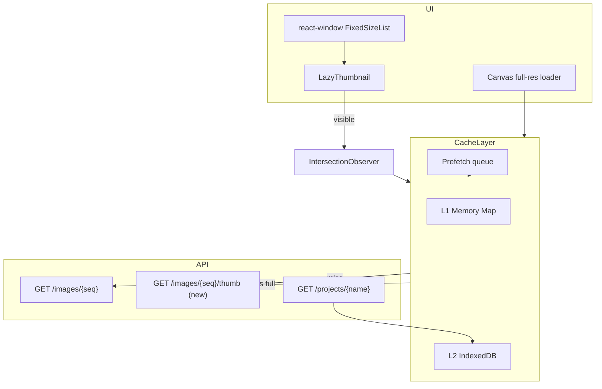

# Annotation Tool: Virtualized Lazy Loading + Smart Cache

## Problem

- Opening a project fires **N parallel full-resolution** `GET /images/{seq}` requests (canvas + every thumbnail).
- Frontend cache covers **JSON only** (5 min in-memory); images are never cached.
- Backend has no thumbnails; Azure path lists all blobs per image request.
- Export failures are hard to diagnose without structured logs (addressed in Phase 0).

## Goals

1. Render only **visible** thumbnails (virtualization).
2. Load image bytes **on demand** (IntersectionObserver).
3. **Cache** thumbnails + annotations + OCR in memory + IndexedDB.
4. **Prefetch** current ±1 image for smooth navigation.
5. Keep canvas on **full-res** only for the active image.

---

## Architecture Overview



---

## Phase 0 — Export diagnostics (done)

| Layer | What |
|-------|------|
| Backend | `_export_storage_context()`, step logs, 404/500 with paths, ZIP image add/skip counts |
| Frontend | `downloadProjectExport()`, `console.error` with status + detail, empty-blob warning |

**How to debug local export:** Restart backend → click export → check terminal for `COCO export started` / `ZIP export 404` and browser console for `[annotation-export:coco]`.

---

## Phase 1 — Dependencies & cache module

### Packages

```bash
cd web_app/core/frontend
npm install react-window idb
npm install -D @types/react-window
```

### New files

| File | Responsibility |
|------|----------------|
| `src/services/annotationImageCache.ts` | L1 memory + L2 IndexedDB, TTL, eviction |
| `src/hooks/useAnnotationImage.ts` | Load blob URL for project/seq/variant |
| `src/hooks/usePrefetchImages.ts` | Prefetch prev/next/current |
| `src/components/annotation/LazyThumbnail.tsx` | IO + cache + placeholder |
| `src/components/annotation/ThumbnailStrip.tsx` | react-window horizontal list |

### Cache key schema

```
annotation-cache:v1:{projectName}:{sequence}:{variant}
  variant = "thumb" | "full"
```

### IndexedDB store (`idb`)

- Store: `images` — `{ key, blob, contentType, fetchedAt, size }`
- Store: `projects` — `{ projectName, detail, annotations, fetchedAt }`
- Store: `ocr` — `{ projectName, sequence, text, fetchedAt }` (future OCR endpoint)
- TTL: 24h images, 5m project detail (align with existing `CACHE_TTL_MS` or extend)

### Memory cache (L1)

- `Map<string, { blobUrl: string; revoked: false }>`
- Max entries ~50 thumbs + 3 full images; LRU evict + `URL.revokeObjectURL`

---

## Phase 2 — Backend thumbnail endpoint (recommended)

Without server thumbnails, lazy loading still helps concurrency but each thumb downloads a full SLD file.

### New endpoint

```
GET /api/v1/annotations/v2/projects/{project_name}/images/{sequence}/thumb?max_edge=200
```

Implementation (`annotation_v2.py` + `project_manager.py`):

1. Resolve image path/blob (reuse `get_image_path` / `get_image_bytes`).
2. PIL resize max edge 200px, JPEG quality 80.
3. Response: `FileResponse` / stream with `Cache-Control: public, max-age=86400`.
4. Optional: write thumb to `{project}/thumbs/{name}_{seq}.jpg` on first request (disk cache).

### Canvas

- Keep existing full `GET /images/{sequence}` for active image only.

---

## Phase 3 — Virtualized thumbnail strip

### Replace in `AnnotationToolPage.tsx`

Current (loads all images):

```tsx
{activeProject.images.map((img, idx) => (
  
))}
```

Target:

```tsx
<ThumbnailStrip
  projectName={activeProject.name}
  images={activeProject.images}
  currentIndex={currentImageIndex}
  onSelect={setCurrentImageIndex}
/>
```

### `ThumbnailStrip` with react-window

- `FixedSizeList` horizontal, `itemSize={88}`, `height={96}`, `width={containerWidth}`
- `overscanCount={3}` — render ~7 cells instead of N
- Each row cell = `LazyThumbnail`

### `LazyThumbnail` with IntersectionObserver

```tsx
// Pseudocode
const ref = useRef<HTMLDivElement>(null);
const [visible, setVisible] = useState(false);

useEffect(() => {
  const io = new IntersectionObserver(
    ([e]) => { if (e.isIntersecting) setVisible(true); },
    { root: scrollParent, rootMargin: '100px' }
  );
  if (ref.current) io.observe(ref.current);
  return () => io.disconnect();
}, []);

useEffect(() => {
  if (!visible) return;
  loadThumb(projectName, sequence).then(setSrc);
}, [visible, projectName, sequence]);
```

- Placeholder: gray skeleton 80×80 until loaded.
- On unmount: do not revoke blob if still in L1 cache.

---

## Phase 4 — Canvas loader + prefetch

### Decouple canvas image from annotations

Change `useEffect` deps for canvas load to:

```ts
[activeProject?.name, currentImageIndex]
```

Remove `annotations`, `selectedAnnotationId`, `zoom`, `pan` from image reload deps (overlay-only redraw).

### Prefetch hook

```ts
usePrefetchImages(projectName, images, currentImageIndex, {
  thumbRadius: 2,  // idx-2..idx+2 thumbs
  fullRadius: 1,   // idx-1, idx, idx+1 full (optional, lower priority)
});
```

- Use `requestIdleCallback` or `setTimeout(0)` queue.
- AbortController cancel stale prefetches on index change.

---

## Phase 5 — Annotations & project JSON in IndexedDB

### Extend `my_annotation_api.ts`

| Function | Behavior |
|----------|----------|
| `getProject(name)` | Read IDB first if fresh → else fetch → write IDB |
| `saveAnnotations(...)` | Update IDB + invalidate image cache keys for project |
| `invalidateProject(name)` | Clear memory + IDB project + optional images |

### Split payload (optional backend follow-up)

```
GET /projects/{name}/meta     → images[], categories[], no annotations
GET /projects/{name}/annotations → annotations only
```

Reduces first-open latency; can be Phase 5b.

---

## Phase 6 — OCR cache (when OCR exists)

- Store OCR per `(projectName, sequence)` in IDB store `ocr`.
- Load when image becomes visible or on canvas image change.
- If no OCR API yet, stub interface in `annotationOcrCache.ts` for future wiring.

---

## Phase 7 — Polish & metrics

- Dev-only: `window.__annotationCacheStats()` — hits/misses/evictions.
- Toast if thumb load fails (404) with sequence number.
- Backend: stop listing entire `images/` prefix per request — index by `{project}_{seq}` blob name directly.

---

## Implementation order (recommended)

| Step | Effort | Impact |
|------|--------|--------|
| 0. Export logs | S | Debug downloads |
| 1. `annotationImageCache` + hooks | M | Foundation |
| 2. Thumbnail API | M | Large bandwidth win |
| 3. react-window + LazyThumbnail | M | DOM + network concurrency |
| 4. Canvas deps + prefetch | S | Perceived speed |
| 5. IDB for project/annotations | M | Faster reopen |
| 6. OCR cache | S | Future-ready |
| 7. Backend blob path fix | S | Azure perf |

---

## Testing checklist

- [ ] Project with 50+ images: Network tab shows ≤10 thumb requests on open.
- [ ] Scroll strip: new thumbs load as they enter viewport.
- [ ] Navigate images: prev/next feel instant after first prefetch.
- [ ] Reload page: project list/detail served from IDB within TTL.
- [ ] Export COCO/ZIP: backend logs show `coco_exists`, `images_added`.
- [ ] Local 404: log shows exact `coco_path` missing.

---

## Risks & mitigations

| Risk | Mitigation |
|------|------------|
| IndexedDB quota | Thumb JPEGs only; cap store size; LRU eviction |
| Blob URL leaks | Central revoke in cache module |
| react-window + horizontal scroll | Use `layout="horizontal"` or `VariableSizeList` with fixed width |
| CORS on blob URLs | Same-origin API; blob from fetch response |
| Full-res still slow first paint | Expected; thumb strip should not block canvas |

---

## Files to touch (summary)

**Backend:** `annotation_v2.py`, `project_manager.py`  
**Frontend:** `AnnotationToolPage.tsx`, new `components/annotation/*`, `services/annotationImageCache.ts`, `services/my_annotation_api.ts`, `package.json`
